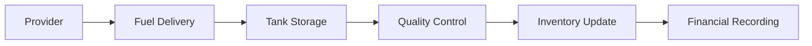
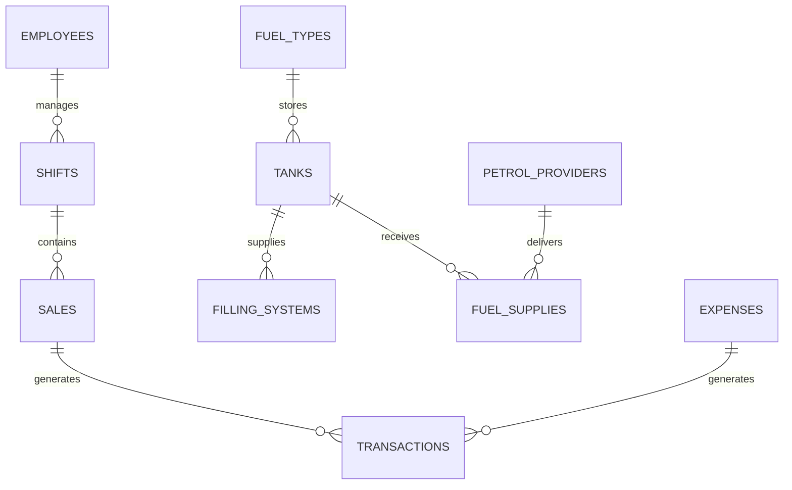
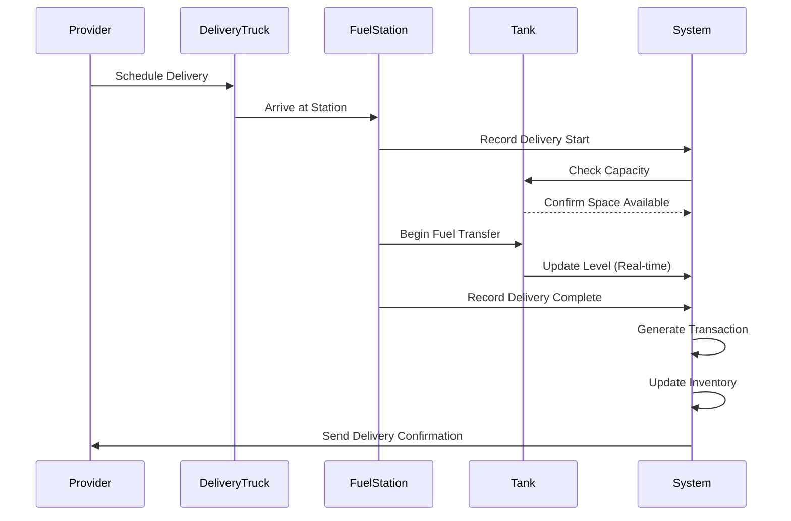
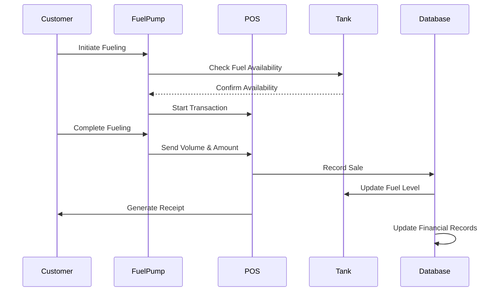
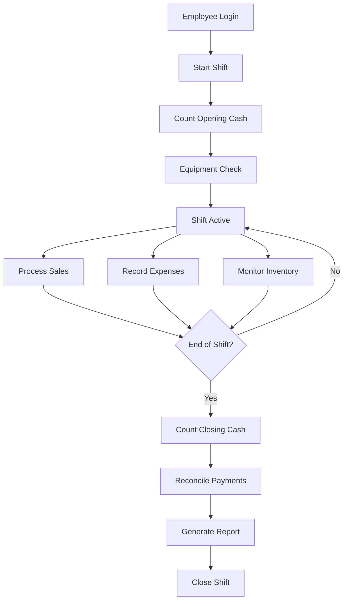

# 🛢️ **Ararat Oil Management System**

> **Comprehensive Fuel Station & Oil Distribution Management Platform**

[](http://localhost:3005)
[](https://reactjs.org/)
[](https://www.typescriptlang.org/)
[](https://supabase.io/)
[](https://tailwindcss.com/)

---

## 📋 **Table of Contents**

1. [**Business Overview**](#-business-overview)
2. [**Core Business Logic**](#-core-business-logic)
3. [**System Architecture**](#-system-architecture)
4. [**Development Stack**](#-development-stack)
5. [**Business Domains**](#-business-domains)
6. [**Key Features**](#-key-features)
7. [**Data Flow & Workflows**](#-data-flow--workflows)
8. [**API Architecture**](#-api-architecture)
9. [**Security & Performance**](#-security--performance)
10. [**Development Guide**](#-development-guide)
11. [**Deployment & Infrastructure**](#-deployment--infrastructure)

---

## 🏢 **Business Overview**

**Ararat Oil** is a comprehensive management system designed for fuel stations, oil distribution companies, and petroleum businesses. The platform provides end-to-end management of:

- **Fuel Operations**: Supply chain, inventory, tank management
- **Sales & Commerce**: Point-of-sale, transaction processing, shift management
- **Financial Management**: Profit/loss tracking, expense management, financial reporting
- **Human Resources**: Employee management, shift tracking, role-based access
- **Business Intelligence**: Comprehensive reporting, analytics, dashboard insights

### **Target Industries:**
- ⛽ **Fuel Stations** - Retail gasoline/diesel stations
- 🛢️ **Oil Distribution** - Wholesale petroleum operations
- 🚛 **Fleet Management** - Commercial fuel operations
- 🏭 **Industrial Fuel** - Manufacturing fuel supply management

---

## 💼 **Core Business Logic**

### **1. Fuel Supply Chain Management**

#### **Delivery & Procurement**


**Business Rules:**
- All fuel deliveries must be tracked from provider to tank
- Tank capacity limits are enforced during deliveries
- Cost calculation: `total_cost = quantity_liters × price_per_liter`
- Automatic inventory level updates upon delivery confirmation

#### **Inventory Management**
- **Real-time Tank Monitoring**: Current levels, capacity utilization
- **Automated Low-Stock Alerts**: Configurable thresholds per fuel type
- **Historical Tracking**: All level changes with timestamps and reasons
- **Multi-Fuel Support**: Diesel, Regular Gas, Premium Gas, etc.

### **2. Sales Operations**

#### **Point-of-Sale System**
```typescript
interface SaleTransaction {
  fuel_type: FuelTypeCode;           // diesel, gas, petrol_regular, petrol_premium
  quantity_liters: number;           // Volume sold
  unit_price: number;               // Price per liter
  total_amount: number;             // quantity × unit_price
  payment_method: PaymentMethod;    // cash, card, mobile_payment, etc.
  meter_readings: {                 // Pump meter validation
    start: number;
    end: number;
  };
  shift_id: string;                // Associated work shift
  filling_system_id: string;      // Which pump was used
}
```

**Business Rules:**
- Each sale must be linked to an active shift
- Meter readings validate dispensed quantities
- Tank levels automatically decrease with each sale
- Multiple payment methods supported per transaction

#### **Shift Management**
- **Opening Procedures**: Cash count, equipment checks, employee assignment
- **Real-time Tracking**: Sales totals, payment breakdowns, transaction logs
- **Closing Procedures**: Final cash count, payment reconciliation, report generation
- **Multi-employee Shifts**: Support for team-based operations

### **3. Financial Management**

#### **Revenue Tracking**
```typescript
interface FinancialSummary {
  period: DateRange;
  total_sales: number;              // Gross sales revenue
  total_expenses: number;           // Operating expenses
  gross_profit: number;             // Sales - Cost of Goods Sold
  net_profit: number;               // Gross profit - Operating expenses
  cost_of_goods_sold: number;       // Fuel purchase costs
  operating_expenses: {             // Categorized expenses
    utilities: number;
    maintenance: number;
    salaries: number;
    supplies: number;
    other: number;
  };
}
```

**Business Rules:**
- Daily profit/loss calculations
- Automated expense categorization
- Multi-currency support (configurable)
- Tax calculation integration ready

#### **Expense Management**
- **Categorized Tracking**: Utilities, maintenance, salaries, supplies
- **Receipt Management**: Digital receipt storage and verification
- **Approval Workflows**: Multi-level expense approval system
- **Vendor Management**: Supplier payment tracking

### **4. Human Resources**

#### **Employee Management**
```typescript
interface Employee {
  id: string;
  name: string;
  position: string;                 // Manager, Cashier, Attendant, etc.
  contact: string;
  salary: number;
  hire_date: string;
  status: EmployeeStatus;          // active, inactive, on_leave
  permissions: RolePermissions;     // Feature access control
  shift_history: Shift[];          // Historical shift data
}
```

**Business Rules:**
- Role-based access control (RBAC)
- Shift assignment and tracking
- Performance metrics tracking
- Payroll integration ready

---

## 🏗️ **System Architecture**

### **Frontend Architecture (React + TypeScript)**

```
src/
├── 📁 features/              # Feature-based architecture
│   ├── 📁 auth/             # Authentication & authorization
│   ├── 📁 dashboard/        # Main dashboard & analytics
│   ├── 📁 employees/        # Employee management
│   ├── 📁 expenses/         # Expense tracking
│   ├── 📁 filling-systems/  # Pump management
│   ├── 📁 finance/          # Financial operations
│   ├── 📁 fuel-management/  # Fuel operations
│   ├── 📁 fuel-supplies/    # Supply chain management
│   ├── 📁 inventory/        # Inventory tracking
│   ├── 📁 sales/            # Sales operations
│   ├── 📁 shifts/           # Shift management
│   └── 📁 tanks/            # Tank monitoring
├── 📁 core/                 # Shared core functionality
│   ├── 📁 api/              # API interfaces & types
│   ├── 📁 components/       # Reusable UI components
│   └── 📁 utils/            # Helper functions
├── 📁 shared/               # Cross-feature shared code
│   ├── 📁 components/       # Common UI components
│   ├── 📁 hooks/            # Custom React hooks
│   └── 📁 utils/            # Utility functions
├── 📁 services/             # External service integrations
│   ├── 📄 supabase.ts       # Database client
│   ├── 📄 api.ts            # Main API service
│   └── 📄 [domain].ts       # Domain-specific services
└── 📁 types/                # TypeScript type definitions
```

### **Backend Architecture (Supabase)**

```sql
-- Core Business Tables
Users (Authentication)
  ├── Employees (HR Management)
  ├── Shifts (Work shift tracking)
  └── Permissions (Role-based access)

Fuel Operations
  ├── Fuel_Types (Product catalog)
  ├── Tanks (Storage management)
  ├── Filling_Systems (Dispensing equipment)
  ├── Petrol_Providers (Supplier management)
  └── Fuel_Supplies (Procurement tracking)

Sales & Finance
  ├── Sales (Transaction records)
  ├── Transactions (Financial ledger)
  ├── Expenses (Cost tracking)
  ├── Shift_Payment_Methods (Payment reconciliation)
  └── Profit_Loss (Financial reporting)
```

### **Data Relationships**



---

## 🛠️ **Development Stack**

### **Frontend Technologies**

| Technology | Version | Purpose | Key Features |
|------------|---------|---------|--------------|
| **React** | 18.3.1 | UI Framework | Concurrent features, Suspense, Error boundaries |
| **TypeScript** | 5.5.3 | Type Safety | Strict typing, Enhanced IDE support |
| **Vite** | 5.4.1 | Build Tool | HMR, Fast builds, ES modules |
| **Tailwind CSS** | 4.1.7 | Styling | Utility-first, JIT compilation |
| **Radix UI** | Latest | UI Components | Accessible, Customizable primitives |
| **React Query** | 5.56.2 | Data Fetching | Caching, Background updates, Optimistic updates |
| **React Router** | 6.26.2 | Navigation | Client-side routing, Nested routes |
| **Zustand** | 5.0.3 | State Management | Lightweight, DevTools integration |
| **React Hook Form** | 7.53.0 | Form Management | Performance, Validation, Less re-renders |
| **Date-fns** | 3.6.0 | Date Handling | Immutable, Tree-shakable |
| **Recharts** | 2.12.7 | Data Visualization | Responsive charts, Customizable |

### **Backend Technologies**

| Technology | Purpose | Key Features |
|------------|---------|--------------|
| **Supabase** | Backend-as-a-Service | PostgreSQL, Real-time, Authentication |
| **PostgreSQL** | Database | ACID compliance, JSON support, Extensible |
| **Edge Functions** | Serverless APIs | Global distribution, TypeScript support |
| **Row Level Security** | Data Security | Fine-grained access control |
| **Real-time** | Live Updates | WebSocket-based, Automatic scaling |

### **Development Tools**

| Tool | Purpose | Configuration |
|------|---------|--------------|
| **ESLint** | Code Linting | React hooks, TypeScript rules |
| **Prettier** | Code Formatting | Consistent styling |
| **Vitest** | Testing | Unit tests, Coverage reports |
| **Storybook** | Component Documentation | Isolated component development |
| **TypeScript ESLint** | Type Checking | Strict mode, Advanced rules |

### **Production Stack**

| Service | Purpose | Configuration |
|---------|---------|--------------|
| **Vercel** | Frontend Hosting | Edge deployment, Automatic deployments |
| **Supabase Cloud** | Backend Services | Auto-scaling, Global CDN |
| **Sentry** | Error Monitoring | Performance tracking, Error reporting |
| **GitHub Actions** | CI/CD | Automated testing, Deployment |

---

## 🏪 **Business Domains**

### **1. 👥 Employee Management**
- **Employee Profiles**: Personal info, contact details, employment history
- **Role Management**: Position-based permissions and access control
- **Shift Assignment**: Work schedule management and tracking
- **Performance Tracking**: KPIs, sales metrics, attendance records

### **2. 💰 Financial Operations**
- **Revenue Tracking**: Daily, weekly, monthly sales summaries
- **Expense Management**: Categorized cost tracking with receipt storage
- **Profit/Loss Analysis**: Automated financial reporting and trends
- **Payment Processing**: Multi-method payment reconciliation

### **3. ⛽ Fuel Operations**
- **Tank Management**: Real-time level monitoring and capacity tracking
- **Supply Chain**: Delivery scheduling, quality control, cost tracking
- **Dispensing Systems**: Pump management, meter reading validation
- **Quality Assurance**: Fuel testing, contamination monitoring

### **4. 📊 Sales & Customer Service**
- **Point-of-Sale**: Transaction processing, receipt generation
- **Customer Management**: Loyalty programs, purchase history
- **Pricing Management**: Dynamic pricing, promotional campaigns
- **Sales Analytics**: Performance metrics, trend analysis

### **5. 📋 Inventory & Supply Chain**
- **Stock Monitoring**: Real-time inventory levels across all products
- **Supplier Management**: Vendor relationships, contract management
- **Procurement**: Purchase orders, delivery tracking, quality control
- **Loss Prevention**: Shrinkage tracking, audit trails

### **6. 📈 Business Intelligence**
- **Dashboard Analytics**: Real-time KPIs and performance metrics
- **Reporting Engine**: Customizable reports for all business areas
- **Trend Analysis**: Historical data insights and forecasting
- **Regulatory Compliance**: Environmental and safety reporting

---

## ⭐ **Key Features**

### **🔒 Security Features**
- **Multi-factor Authentication**: SMS, Email, Authenticator app support
- **Role-based Access Control**: Granular permissions per feature
- **Audit Logging**: Complete activity tracking for compliance
- **Data Encryption**: End-to-end encryption for sensitive data
- **Session Management**: Automatic timeout, concurrent session control

### **📱 User Experience**
- **Responsive Design**: Mobile-first approach for all devices
- **Real-time Updates**: Live data synchronization across all clients
- **Offline Capability**: Critical functions work without internet
- **Internationalization**: Multi-language support (i18n ready)
- **Accessibility**: WCAG 2.1 AA compliance

### **⚡ Performance**
- **Code Splitting**: Lazy loading for optimal bundle sizes
- **Caching Strategy**: Intelligent data caching with React Query
- **Image Optimization**: Automatic compression and WebP support
- **Bundle Analysis**: Performance monitoring and optimization
- **CDN Integration**: Global content delivery for fast loading

### **🔧 Administrative Tools**
- **System Configuration**: Customizable business rules and settings
- **Data Import/Export**: CSV, Excel support for bulk operations
- **Backup Management**: Automated daily backups with restore options
- **User Management**: Admin panel for user and permission management
- **System Monitoring**: Health checks, performance metrics, alerts

---

## 🔄 **Data Flow & Workflows**

### **1. Fuel Delivery Workflow**



### **2. Sales Transaction Workflow**



### **3. Shift Management Workflow**



---

## 🔌 **API Architecture**

### **REST API Endpoints**

#### **Authentication & Users**
```typescript
POST   /auth/login                 // User authentication
POST   /auth/logout                // Session termination
GET    /auth/profile               // Current user profile
PUT    /auth/profile               // Update user profile
```

#### **Employee Management**
```typescript
GET    /api/employees              // List all employees
POST   /api/employees              // Create new employee
GET    /api/employees/:id          // Get employee details
PUT    /api/employees/:id          // Update employee
DELETE /api/employees/:id          // Deactivate employee
```

#### **Fuel Operations**
```typescript
GET    /api/tanks                  // List all tanks
POST   /api/tanks                  // Create new tank
GET    /api/tanks/:id              // Get tank details
PUT    /api/tanks/:id/level        // Update tank level
GET    /api/tanks/:id/history      // Get level change history

GET    /api/fuel-supplies          // List deliveries
POST   /api/fuel-supplies          // Record new delivery
GET    /api/fuel-supplies/:id      // Get delivery details
PUT    /api/fuel-supplies/:id      // Update delivery
```

#### **Sales & Transactions**
```typescript
GET    /api/sales                  // List sales
POST   /api/sales                  // Record new sale
GET    /api/sales/:id              // Get sale details
GET    /api/sales/shift/:shiftId   // Sales by shift

GET    /api/shifts                 // List shifts
POST   /api/shifts                 // Start new shift
PUT    /api/shifts/:id/close       // Close shift
GET    /api/shifts/:id/summary     // Shift summary
```

#### **Financial Management**
```typescript
GET    /api/transactions           // List transactions
GET    /api/transactions/summary   // Financial summary
GET    /api/expenses               // List expenses
POST   /api/expenses               // Record expense
GET    /api/profit-loss            // P&L reports
```

### **Real-time Subscriptions**
```typescript
// Live data updates using Supabase subscriptions
supabase
  .channel('tank-levels')
  .on('postgres_changes', {
    event: 'UPDATE',
    schema: 'public',
    table: 'tanks'
  }, (payload) => {
    // Handle real-time tank level updates
  })
  .subscribe();
```

### **Error Handling**
```typescript
interface APIResponse<T> {
  data?: T;
  error?: {
    code: string;
    message: string;
    details?: any;
  };
  meta?: {
    total?: number;
    page?: number;
    per_page?: number;
  };
}
```

---

## 🔐 **Security & Performance**

### **Security Measures**

#### **Authentication & Authorization**
- **JWT Tokens**: Secure token-based authentication
- **Row Level Security**: Database-level access control
- **API Rate Limiting**: Protection against abuse
- **CORS Configuration**: Secure cross-origin requests
- **Input Validation**: Comprehensive data sanitization

#### **Data Protection**
- **Encryption at Rest**: All sensitive data encrypted
- **Encryption in Transit**: HTTPS/TLS for all communications
- **PII Protection**: Personal information handling compliance
- **Audit Trails**: Complete activity logging
- **Data Retention**: Configurable retention policies

### **Performance Optimizations**

#### **Frontend Performance**
```typescript
// Code splitting for feature modules
const DashboardFeature = lazy(() => import('@/features/dashboard'));
const SalesFeature = lazy(() => import('@/features/sales'));

// React Query caching configuration
const queryClient = new QueryClient({
  defaultOptions: {
    queries: {
      staleTime: 5 * 60 * 1000,      // 5 minutes
      gcTime: 10 * 60 * 1000,        // 10 minutes
      retry: 2,
    },
  },
});
```

#### **Database Performance**
- **Indexing Strategy**: Optimized queries for large datasets
- **Connection Pooling**: Efficient database connection management
- **Query Optimization**: Minimized N+1 queries
- **Caching Layers**: Redis for frequently accessed data
- **Data Pagination**: Efficient large dataset handling

#### **Monitoring & Analytics**
- **Performance Monitoring**: Real-time application metrics
- **Error Tracking**: Comprehensive error reporting
- **User Analytics**: Usage patterns and optimization insights
- **Infrastructure Monitoring**: Server health and performance

---

## 🚀 **Development Guide**

### **Getting Started**

#### **Prerequisites**
- Node.js 18+ with npm
- Git for version control
- Modern web browser (Chrome, Firefox, Safari, Edge)
- Supabase account for backend services

#### **Installation**
```bash
# Clone the repository
git clone <repository-url>
cd ararat-oil-management

# Install dependencies
npm install

# Set up environment variables
cp .env.example .env
# Edit .env with your Supabase credentials

# Start development server
npm run dev

# Access application
# Local: http://localhost:3005
# Network: http://[your-ip]:3005
```

#### **Environment Configuration**
```bash
# .env file
VITE_SUPABASE_URL=your_supabase_url
VITE_SUPABASE_ANON_KEY=your_supabase_anon_key
VITE_DEV_PORT=3005
VITE_SENTRY_DSN=your_sentry_dsn
VITE_APP_ENVIRONMENT=development
```

### **Development Commands**

```bash
# Development
npm run dev                    # Start development server
npm run dev:clean             # Start with cache clearing
npm run dev:debug             # Start with debug mode

# Building
npm run build                 # Production build
npm run build:analyze         # Build with bundle analysis
npm run preview               # Preview production build

# Testing
npm run test                  # Run unit tests
npm run test:coverage         # Run tests with coverage
npm run lint                  # ESLint code checking
npm run lint:fix              # Auto-fix linting issues

# Maintenance
npm run clean                 # Clear caches and build files
npm run typecheck             # TypeScript type checking
```

### **Feature Development**

#### **Creating a New Feature**
```bash
# Feature structure
src/features/my-feature/
├── components/              # Feature-specific components
│   ├── MyFeatureList.tsx
│   ├── MyFeatureForm.tsx
│   └── index.ts
├── hooks/                   # Custom hooks for data fetching
│   ├── useMyFeature.ts
│   ├── useMyFeatureMutations.ts
│   └── index.ts
├── services/                # API service functions
│   ├── myFeatureApi.ts
│   └── index.ts
├── types/                   # TypeScript interfaces
│   ├── myFeature.types.ts
│   └── index.ts
└── index.ts                 # Feature exports
```

#### **Best Practices**
- **TypeScript First**: Always define types before implementation
- **Component Composition**: Prefer composition over inheritance
- **Custom Hooks**: Extract data fetching logic into reusable hooks
- **Error Boundaries**: Implement error handling at feature level
- **Testing**: Write unit tests for all business logic
- **Documentation**: Document complex business rules and APIs

### **Database Development**

#### **Supabase Setup**
```sql
-- Enable RLS (Row Level Security)
ALTER TABLE employees ENABLE ROW LEVEL SECURITY;

-- Create policies
CREATE POLICY "Users can view their own data"
  ON employees
  FOR SELECT
  USING (auth.uid() = user_id);

-- Create functions
CREATE OR REPLACE FUNCTION calculate_profit(
  start_date DATE,
  end_date DATE
) RETURNS NUMERIC AS $$
BEGIN
  -- Business logic implementation
END;
$$ LANGUAGE plpgsql;
```

#### **Migration Strategy**
```bash
# Database migrations
npx supabase migration new add_tanks_table
npx supabase db push
npx supabase gen types typescript --local > src/types/supabase.ts
```

---

## 🌐 **Deployment & Infrastructure**

### **Production Deployment**

#### **Frontend (Vercel)**
```bash
# Build for production
npm run build

# Deploy to Vercel
vercel --prod

# Environment variables in Vercel dashboard:
VITE_SUPABASE_URL=production_url
VITE_SUPABASE_ANON_KEY=production_key
VITE_APP_ENVIRONMENT=production
```

#### **Backend (Supabase)**
```bash
# Deploy Edge Functions
npx supabase functions deploy --project-ref your-project-ref

# Deploy database migrations
npx supabase db push --project-ref your-project-ref
```

### **Infrastructure Monitoring**

#### **Performance Metrics**
- **Core Web Vitals**: LCP, FID, CLS monitoring
- **Database Performance**: Query execution times, connection pooling
- **API Response Times**: Endpoint performance tracking
- **Error Rates**: Application and infrastructure errors
- **User Experience**: Page load times, interaction metrics

#### **Alerting Configuration**
```yaml
# Example alert configuration
alerts:
  - name: "High Error Rate"
    condition: error_rate > 5%
    duration: 5m
    notification: slack, email
  
  - name: "Database Slow Queries"
    condition: query_time > 2s
    duration: 1m
    notification: team_lead
```

### **Backup & Recovery**

#### **Database Backups**
- **Automated Daily Backups**: Full database backups
- **Point-in-Time Recovery**: Transaction log backups
- **Cross-Region Replication**: Disaster recovery preparation
- **Backup Testing**: Regular restore testing procedures

#### **Application Recovery**
- **Blue-Green Deployments**: Zero-downtime deployments
- **Rollback Procedures**: Quick reversion to previous versions
- **Health Check Monitoring**: Automatic failure detection
- **Incident Response**: Documented recovery procedures

---

## 📊 **Key Performance Indicators**

### **Business Metrics**
- **Daily Sales Volume**: Liters sold per day
- **Revenue per Gallon**: Profit margins by fuel type
- **Inventory Turnover**: Stock rotation efficiency
- **Customer Satisfaction**: Service quality metrics
- **Operational Efficiency**: Cost per transaction

### **Technical Metrics**
- **Application Uptime**: 99.9% availability target
- **Response Time**: <2s page load time
- **Database Performance**: <100ms query response
- **Error Rate**: <0.1% error occurrence
- **Security Incidents**: Zero tolerance policy

---

## 🔮 **Future Roadmap**

### **Planned Features**
- **Mobile Application**: iOS/Android companion apps
- **IoT Integration**: Direct tank sensor integration
- **Advanced Analytics**: Machine learning insights
- **Multi-location Support**: Franchise management
- **Customer Portal**: Self-service customer interface
- **ERP Integration**: SAP, Oracle, QuickBooks connectivity

### **Technology Upgrades**
- **React 19**: Latest React features and optimizations
- **PostgreSQL 16**: Advanced database features
- **Edge Computing**: Cloudflare Workers integration
- **GraphQL API**: More efficient data fetching
- **Progressive Web App**: Enhanced mobile experience

---

## 📞 **Support & Contact**

### **Technical Support**
- **Documentation**: Comprehensive guides and API references
- **Developer Forum**: Community support and discussions
- **Bug Reports**: GitHub issues for technical problems
- **Feature Requests**: Product roadmap feedback

### **Business Support**
- **Training**: User training and onboarding programs
- **Consultation**: Business process optimization
- **Custom Development**: Tailored feature development
- **24/7 Support**: Critical issue emergency support

---

## 📄 **License & Legal**

### **Software License**
- **Commercial License**: Enterprise usage rights
- **Open Source Components**: MIT, Apache 2.0 compliance
- **Third-party Licenses**: Complete attribution documentation

### **Data Privacy**
- **GDPR Compliance**: European data protection standards
- **CCPA Compliance**: California privacy regulations
- **SOC 2 Type II**: Security and availability controls
- **PCI DSS**: Payment card industry standards

---

**🛢️ Ararat Oil Management System - Powering the Future of Fuel Station Operations**

*Built with ❤️ using modern web technologies for maximum performance, security, and scalability.* 